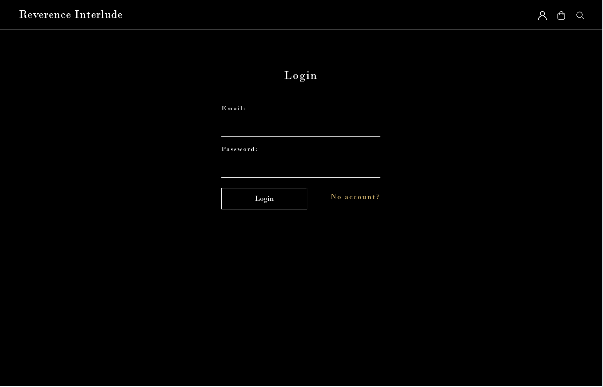
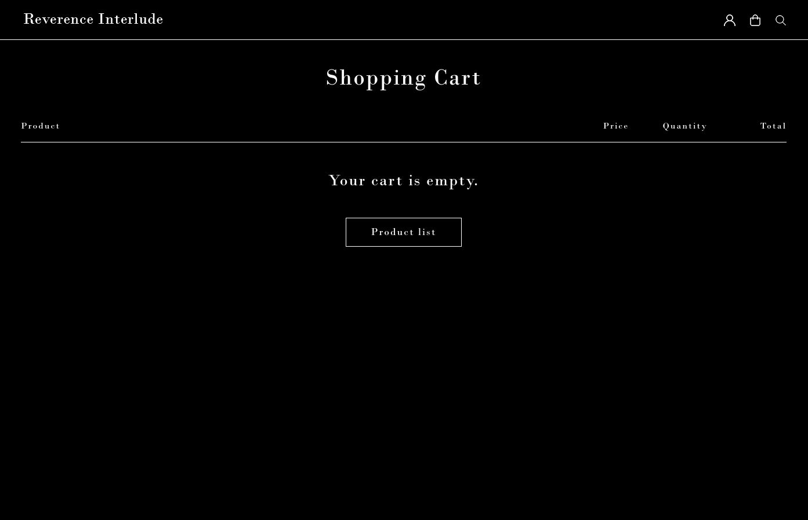
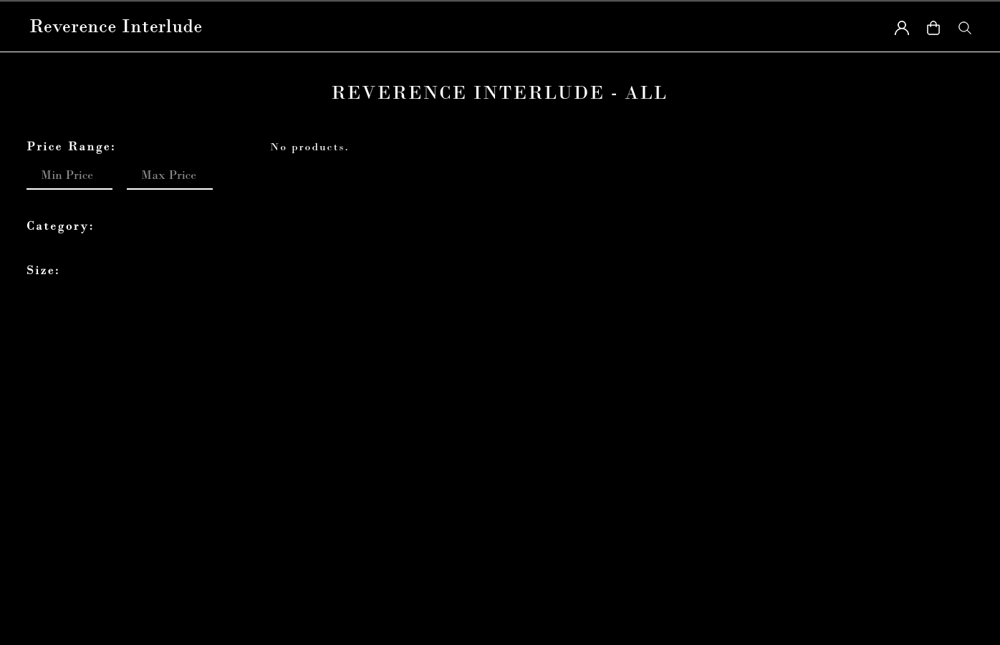

# Документация Django проекта

## Обзор проекта
Краткое описание функционала вашего сайта...

---

## Скриншоты интерфейса
Вставьте ниже ссылки на изображения вашего проекта (поддерживаются локальные пути или URL):

### 1. Главная страница
  
*Пример: Скриншот главной страницы*

### 2. Административная панель
  
*Пример: Управление контентом*

### 3. Мобильная версия
  
*Пример: Адаптивный дизайн*

---

## Инструкция по добавлению изображений
1. Замените пути в скобках на ваши реальные изображения:
   ```markdown
   
